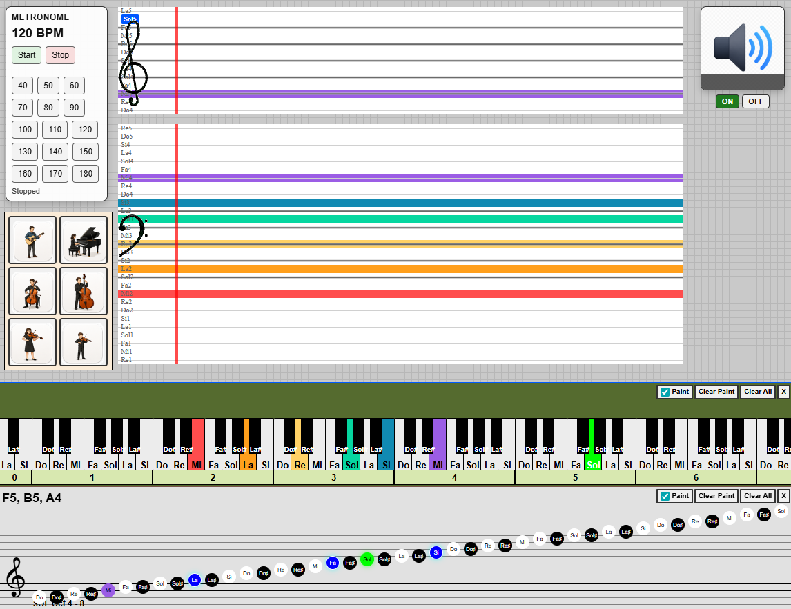
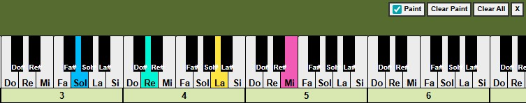
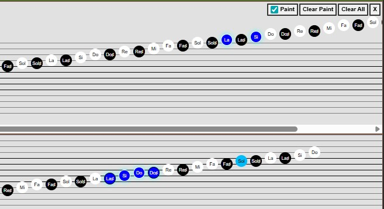
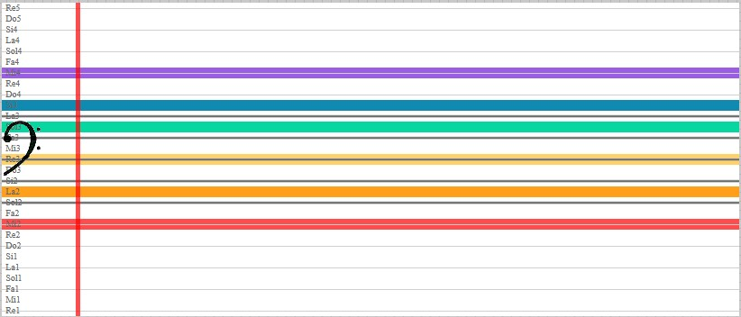
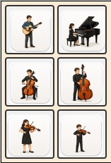
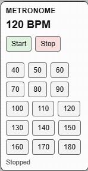
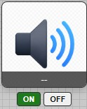

# MIDI Note Visualizer

A small web app that reads notes from a connected MIDI keyboard and visualizes them on a piano keyboard, staff views, and speed-staff practice lanes. It uses the browser Web MIDI API, so note capture requires a real MIDI keyboard or MIDI controller connected to a compatible browser.



## Features

- Plain HTML, CSS, and JavaScript.
- Web Components for the piano, staffs, instrument layout, metronome, speaker, music board, and speed staffs.
- Piano range initialization by octave, MIDI note, or note name.
- Staff views for SOL, FA, and DO clefs.
- Instrument selector with open-string note highlights for guitar, piano, cello, double bass, viola, and violin.
- Shared note highlight events using note/color payloads.
- Clear Paint and Clear All controls for active notes and custom highlights.
- Optional Web MIDI input when the browser supports it.

## Run

Open `src/index.html` in a browser, or serve the `src` directory with a small static server:

```sh
python -m http.server 8000 --directory src
```

Then open `http://127.0.0.1:8000/`.

## Components

### Piano Keyboard

`<midi-keyboard>` renders a playable piano keyboard. It supports MIDI, note-name, and octave based ranges.



```js
Piano.initRange("A0", "C8");
Piano.initMidi(21, 108);
Piano.initOctave(0, 8);
Piano.clearPaint();
Piano.clearAll();
Piano.destroy();
```

### Staffs

`<music-staff>` renders note positions on SOL, FA, or DO clefs. `Staff` manages the staffs inside `#staffs-container`.



```js
Staff.initRange("C4", "C8", "SOL");
Staff.initRange("A0", "C4", "FA");
Staff.clearPaint();
Staff.clearAll();
Staff.destroy();
```

### Speed Staff

`<speed-staff>` renders compact practice lanes with staff lines, spaces, note labels, clef images, and an optional red edge line.



```js
SpeedStaff.init({
    name: "Treble",
    clave: "SOL",
    size: { wPercentage: "70", h: null },
    position: { xPercentage: "15", yPx: "50" },
    rows: { guideLinesAbove: 1, guideLinesBelow: 1, heightPx: 12 }
});
SpeedStaff.show.notes(0);
SpeedStaff.show.edgeLine(0);
SpeedStaff.hide.edgeLine(0);
```

### Instrument Layout

`<instrument-layout>` shows instrument buttons. Clicking one logs its English name, clears previous highlights, and emits the selected open-string notes.



```js
document.addEventListener("instrument-selected", (event) => {
    console.log(event.detail.name, event.detail.notes);
});
```

### Music Board

`<music-board>` provides the stage used by `SpeedStaff`.

```js
MusicBoard.init();
MusicBoard.getStage();
```

### Metronome

`<midi-metronome>` provides a simple BPM selector and start/stop controls.



```js
Metronome.init(120);
```

### Speaker

`<midi-speaker>` plays piano-note events through the Web Audio API when enabled.



```js
Speaker.init();
```

## Events

Use `LaunchEvent` to highlight notes across components. Components only care about the `notes` payload.

```js
LaunchEvent({
    notes: [
        { nota: "DO4", color: "yellow" }
    ]
});
```

`instrument-layout` emits:

```js
document.addEventListener("instrument-selected", (event) => {
    console.log(event.detail);
});
```

## Quick API Reference

- `Piano.initRange("A0", "C8")`
- `Piano.clearPaint()`
- `Piano.clearAll()`
- `Staff.initRange("C4", "C8", "SOL")`
- `Staff.clearPaint()`
- `Staff.clearAll()`
- `SpeedStaff.show.notes(index)`
- `SpeedStaff.show.edgeLine(index)`

## Notes

The app represents sounding pitch. For example, guitar open strings are shown as `MI2 LA2 RE3 SOL3 SI3 MI4`, not transposed guitar notation.
